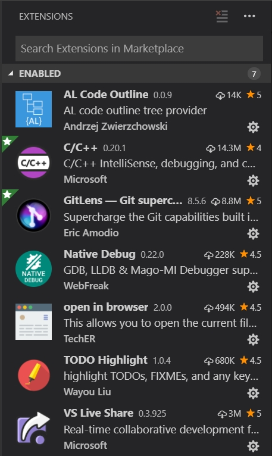
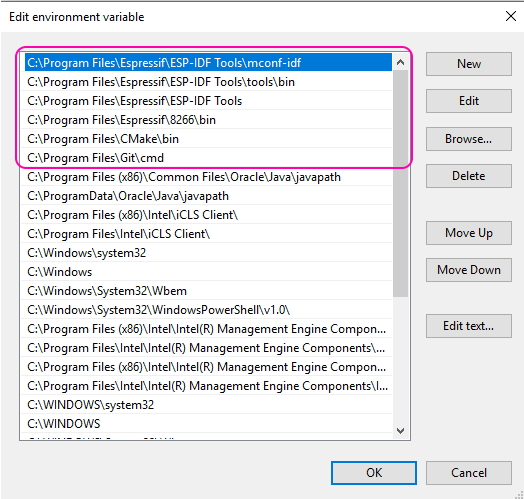
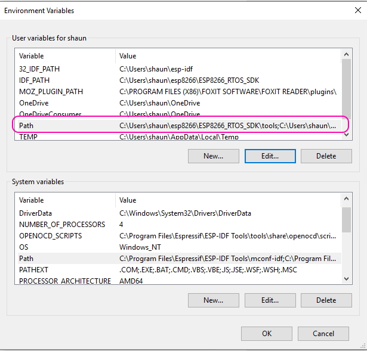
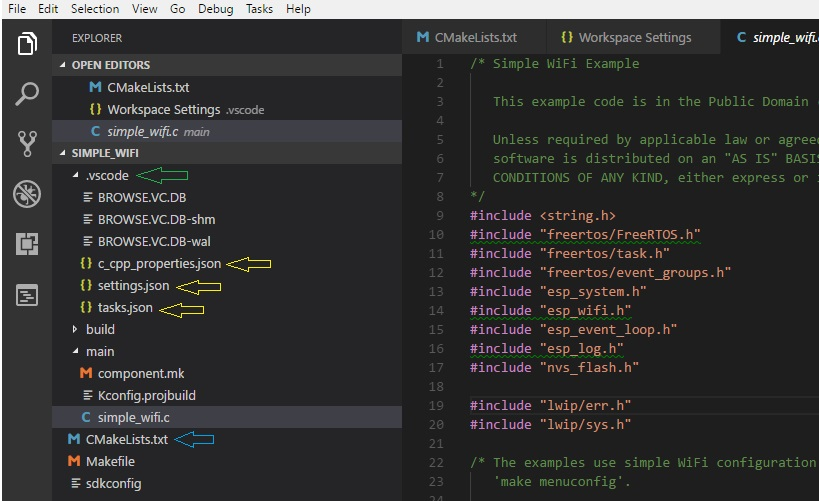
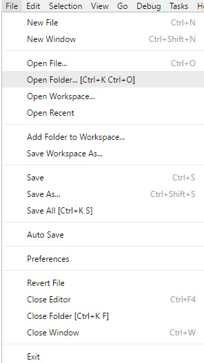
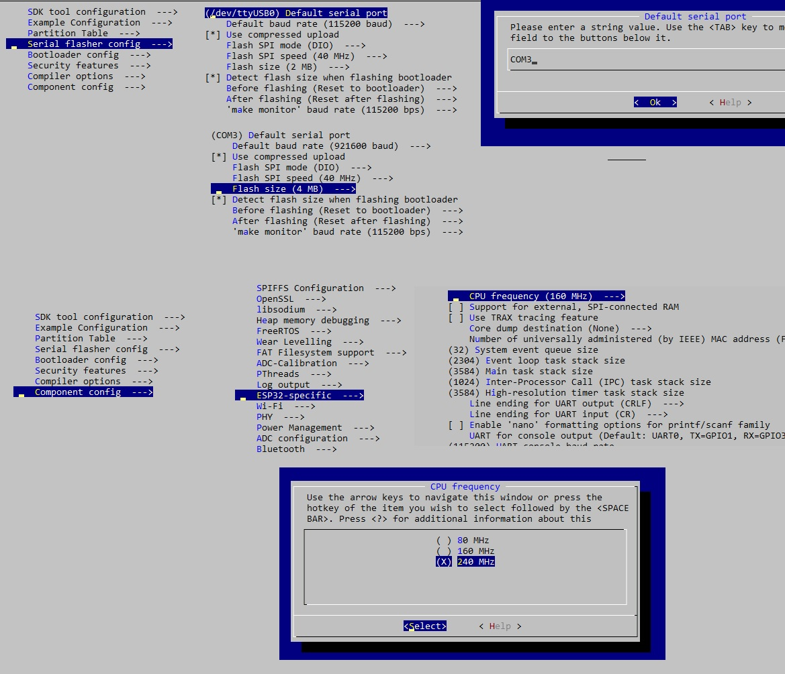
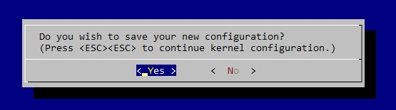

# Setting up Visual Studio Code for ESP32 IDF (FreeRTOS)
Forked from Deous/VSC-Guide-for-esp32.
I'm doing the "For Dummies" edition. Removed the script esp32setenv.bat also

<p align="center">
    <span width=50></span>
    

  <h3 align="center">ESP32 IoT IDF</h3>

  <p align="center">
    Xtensa IoT framework.
  </p>
</p>

## Steps

- [Download and install VSC](#download-and-install-vsc)
- [Install VSC Extensions](#install-vsc-extensions)
- [Setup Toolchain](#setup-toolchain)
- [Setup and verify environment variables](#setup-and-verify-environment-variables)
- [Create project](#create-project)
- [Use Command Line](#Use-the-command-line)
- [Configure ESP32](#configure-esp32)
- [Cmake](#CMake)

## Other Notes
- [What happens on a Panic?](#What-happens-on-a-Panic?)
- [Before using Git](#Git-requirements)

## Download and install VSC

Below link will point to the latest version of the Microsoft code editor which is free and open source. <br/>
Go ahead and download the latest release.<br/>
<br/>
<a href="https://code.visualstudio.com/"><span>Visual Studio Code</span></a>

[To Top](#Steps)

## Install VSC extensions

After the installation open editor and go to 'Extensions' section to browse all available vsc extensions. <br/>
You need the following:<br/>

- C++
- Native Debug
- Code Outline or AL Outline (to display and navigate properties)
- GitLens (useful for reviewing the revision control information)
- Github Markdown Preview (hopefully saves re-working this file after uploading to Git)
- Open in Browser (Right click on html files...open - if you are doing a WebServer)
- VS Live Share - Obviously you are doing code reviews in teams. 



[To Top](#Steps)

## Setup toolchain

Next you need tools for compilation and linking your projects
Go to below link and follow instructions
https://docs.espressif.com/projects/esp-idf/en/feature-cmake/get-started/index.html#setup-toolchain

You need to download all-in-one esp-idf tools installer
<a href="https://dl.espressif.com/dl/esp-idf-tools-setup-1.1.exe">https://dl.espressif.com/dl/esp-idf-tools-setup-1.1.exe</a>
and get the latest ESP-IDF framework

<a href="https://docs.espressif.com/projects/esp-idf/en/feature-cmake/get-started/index.html#get-started-get-esp-idf">How to get ESP-IDF</a>

[To Top](#Steps)

## Setup and verify environment variables

Make sure all path and idf variables are present and pointing to the *right locations* as it had changed between for me compared to the original guide. 
IDF_PATH is cruicial. 
You can use run-command way to set them up with 
>setx IDF_PATH "...your path to esp-idf folder"

Example setup:
<br/>




**Make sure you install Git for Windows**<br/>
<a href="https://git-scm.com/downloads">Git Client download page</a>

[To Top](#Steps)

## Create project

To create a project that will compile you need the following:

### .vscode folder must be present in the root project directory
Lets create the .vscode folder in the project folder if it is not there by magic.
Open vscode, FILE->OPEN FOLDER, select your project folder.
Next: Press F1 and type "c/Cpp: Edit Configurations"

### .vscode folder must have the following files:
 - <a href=".vscode/c_cpp_properties.json">c_cpp_properties.json</a>
 - <a href=".vscode/settings.json">settings.json</a>
 - <a href=".vscode/tasks.json">tasks.json</a>

Copy the files from this guide into the .vscode folder. Overwrite the c_cpp file.

### Time to fix c\_cpp\_properties.json
I am expecting that by the time you are using this, Espressif has changed the 
directory structure again. Open Powershell. Change to the *esp-idf\components* folder.
Enter this command 
>dir -Recurse -Directory | Select FullName | Export-Csv "folders.csv"

Open the folders.csv in notepad++. Do a regex Find and Replace on the following (replace with nothing). Repeat till end of document.
>^(?!.*include").*\r\n 

Perform a regular Find and Replace \ / (converting a backslash to a forward slash as '\' is a delimeter).
Perform a regular Find **C:/.../esp-idf** <- All of the bits in the middle please. Replace with 
>${env:IDF_PATH}

Unfortunately the engineers at Espressif are not nice. So they include some of their .h files
in a different directory (twats) for example components/json/cJSON. Seriously WTF? 

Copy the c\_cpp\_properties.json file and rename to OLD\_c\_cpp\_properties.json as you will probably need to look back to find the non-include ending folders. In c\_cpp\_properties.json, delete all of the entries with {env:IDF_PATH} and replace these with your shiny new list. Check the OLD file for non-include ending folders and see if these are still valid. Copy these across as well.

This should also have (assumming the toolchain is installed as shown)
```json
  {"${workspaceRoot}",
  "${workspaceRoot}/main",
  "${workspaceRoot}/build/config",
  "${workspaceRoot}/build/include",
  "${workspaceRoot}/build",
  "${workspaceRoot}/components",
  "All the shiny new directories compliments of Powershell and Regex",
  "C:/Program Files/Espressif/ESP-IDF Tools/toolchain/xtensa-esp32-elf/include",
  "C:/Program Files/Espressif/ESP-IDF Tools/toolchain/xtensa-esp32-elf/include/c++/5.2.0",
  "C:/Program Files/Espressif/ESP-IDF Tools/toolchain/lib/gcc/xtensa-esp32-elf/5.2.0/include",
  "C:/Program Files/Espressif/ESP-IDF Tools/toolchain/lib/gcc/xtensa-esp32-elf/5.2.0/include-fixed"}
```

Now copy this entire array and replace the "This Section Please." Press SAVE.
```json
  {
    "intelliSenseMode": "clang-x64",
            "browse": {
                "path": [
                  "Replace this section please",
                ],
            }
  }
```

### Lets grab an example project 
This will put the basic file and folder requirements into your project folder.

**I recommend this step to be followed otherwise the later "menuconfig" step will fail.**

Using FileExplorer open 
>[IDF\_PATH]\esp-idf\examples\wifi\getting_started\station

Copy the files in the station folder to your project folder.

[To Top](#Steps)

## Use the command line
If you use the built in Terminal and the compile fails, you will not be able to trace the fault as it closes.
- `idf.py -p COM3 flash` -- will compile and flash the board on port COM3
- `idf.py -p COM3 monitor` -- will display live serial monitor in console

if you want to flash and immediately monitor use 
- `idf.py -p COM3 flash monitor`
 
`build` will build project with changes <br/>
`fullclean` will erase old files and refresh the whole build for new compilation <br/>

Typical project file structure: <br/>



### Important note:
**To open your project you must choose 'Open Folder' option. Do not open a Workspace** <br/>



[To Top](#Steps)

## Configure ESP32
Before compiling your project run the command to set up all necessary settings that IDF will use for your ESP32 chip.<br/>
Use Command window (Don't use the Integrated Terminal) at your project folder. Run ` idf.py menuconfig`<br/>
If you are not in Powershell but in cmd.exe - you can run `powershell idf.py menuconfig`<br/>
<br/>
Example:<br/>
<br/>
<br/>

Hit ESC until menuconfig asks about saving the configuration.<br/>
Confirm save.<br/>
<br/>

[To Top](#Steps)

## CMake 
To use CMake environment your project must have CMakeLists.txt (just like Make files) in project directory
It usually contains the below lines. 

```
set(MAIN_SRCS
    main/spi_master_example_main.c
    main/pretty_effect.c
    main/decode_image.c)

include($ENV{IDF_PATH}/tools/cmake/project.cmake)
project(spi_master)
```

This is your Make Project main file. You can change them to the project files you have. If you create more .c files you will need to add these to this top level CMakeLists.txt file. Change the parameter in project() if you want. 
Follow the examples provided in examples folder together with idf framework that you downloaded
Copy and Paste the example into your project directory so that you do not mess with the original code.
Overwrite the existing files. 

[To Top](#Steps)

## What happens on a Panic?
Check out this page. https://docs.espressif.com/projects/esp-idf/en/latest/get-started/idf-monitor.html
If you are debugging using the Monitor system, then the Guru Meditation Error will display the "Crash Location"
However if not and you get the raw Error Register dump, you can find out the location. Ignore the Register dump, look at the Backtrace.

>Backtrace: 0x400f360d:0x3ffb7e00 0x400dbf56:0x3ffb7e20 0x400dbf5e:0x3ffb7e40 0x400dbf82:0x3ffb7e60 0x400d071d:0x3ffb7e90

You want the following command to evaluate it. (PROJECT is in CMakeLists.txt project(PROJECT)).
The ADDRESS is directly from the backtrace. It is the 0x400...:0x.... value (0x[8digits]:0x[8digits]). This will
give you the function name of the crash. You may have to check more than one to find your code as the crash could
have occurred in the API due to your code.
>xtensa-esp32-elf-addr2line -pfiaC -e build/PROJECT.elf ADDRESS

For example:
>xtensa-esp32-elf-addr2line -pfiaC -e build/spi_maste.elf 0x400f360d:0x3ffb7e00

[To Top](#Other-Notes)

## Git requirements
Before you click on the SourceControl button and add files to a Git Repo, create a .gitignore file to the Project directory. Or copy this one on this Repo. This will save some hassle as you do not need the vscode database files in your repo. 

>.vscode/*.VC.*
>build/

Now go ahead and click on that SourceControl. Be a GIT.

[To Top](#Other-Notes)


Hopefully this works for you, if not please let me know and I will get an update going.
